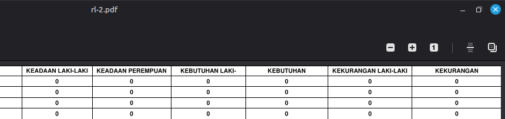
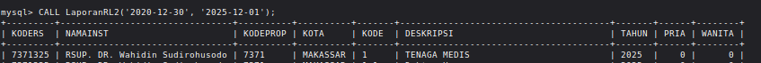
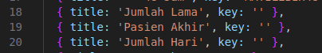
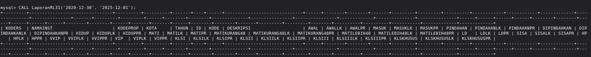
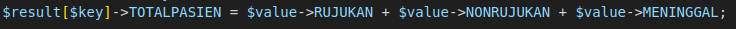
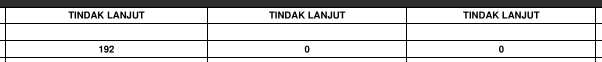
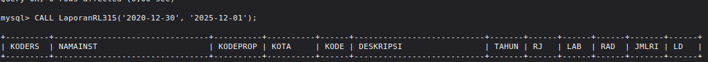
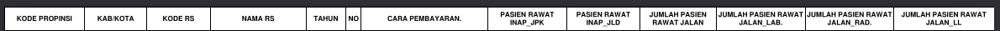
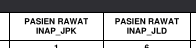

# Beberapa kebingungan di RL
 * 2  
  Jenis kelamin yang harus ditampilkan jenis kelaminnya lebih 2:
 
 tapi kenapa data di DB nggak ada column tersebut atau kolom lain yang bisa pakai buat filter atau apalah:
 
 
 * 3-1  
    ini kurang lebih lawan diatas, 3 kolom ini dari kolom yang mana, kolom tablenya sulit dipahami, pakai singkatan dan penamaan yang sulit dipahami
    
    nama-nama kolom dari db:
    

 * 3-2  
    1. Tidak tau asal muasal kolom total-pasien dari mana, jadi ulun hitung gini:
    
    tapi kurang tau bujur kadanya.
    2. Lawan, ada kolom yang ke-triple tapi recordnya beda:
      
    ulun curiga ini typo dan seharusnya buat nama kolom yg lain.

 * 3-4  
    Ini sama lawan sebelumnya, bingung milih kolomnya

 * 3-5  
    sama

 * 3-12  
    sama, ada beberapa kolom yang bingung pemilihannya

 * 3-15  
    yeah..., ada 2 kolom yang membingungkan.  
    di db:
    
    yg harus ditampilkan:
    
    yang 2 ini yang mulahi bingung:
    
